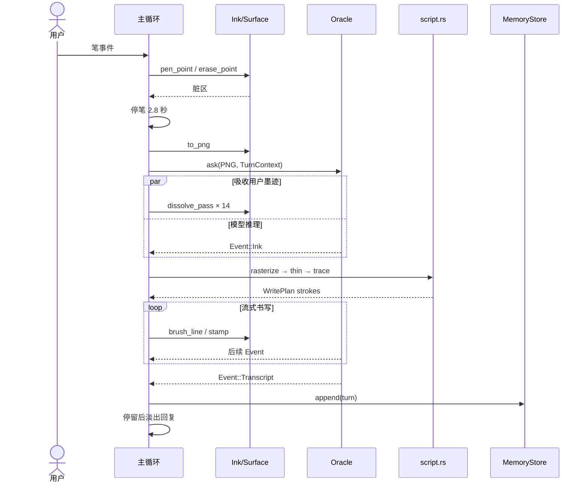

# Riddle 详细设计说明书

> 项目版本：0.3.0<br>
> 代码基线：`main` / `031f68c`<br>
> 目标设备：reMarkable Paper Pro<br>
> 技术栈：Rust 2021、Linux evdev、qtfb、Quill、OpenAI-compatible API / pi RPC

## 1. 文档目的

本文档描述 Riddle 当前代码的详细设计，作为后续功能开发、缺陷修复、设备适配、测试和运维的共同依据。

本文以工作区源码为事实来源，覆盖：

- 应用启动和主事件循环；
- 页面交互状态机；
- 笔、触控和电源输入；
- 帧缓冲及两种显示后端；
- 用户墨迹、PNG 提交和淡出效果；
- LLM 双后端及流式协议；
- 本地记忆和历史页面重现；
- 构建、部署、配置、异常处理和测试；
- 当前实现中的风险及推荐演进方向。

Quill 仓库、厂商 `libqsgepaper.so`、远端模型服务及 pi 内部实现属于外部依赖，不在本文展开。

## 2. 系统概述

Riddle 是运行在 reMarkable Paper Pro 上的手写交互应用。用户直接在电子纸上书写，停笔一段时间后，系统将墨迹提交给视觉模型，吸收页面上的用户笔迹，并把模型回复转换为手写路径逐笔绘制。回复停留后自动消退，页面重新进入可书写状态。

系统主要能力如下：

1. 使用原始 evdev 笔事件采集压力和橡皮擦输入；
2. 支持 qtfb 窗口模式和 Quill 全屏接管模式；
3. 将用户墨迹裁剪、降采样并编码为灰度 PNG；
4. 通过 OpenAI-compatible HTTP 或常驻 pi RPC 获取流式回复；
5. 将字体栅格化、骨架化并追踪为动画笔画；
6. 保存最近页面的转录、回复和原始笔画；
7. 通过自然语言指令重现历史页面；
8. 支持问号帮助、五指退出和接管模式下的休眠恢复。

## 3. 设计约束

| 约束 | 当前设计影响 |
| --- | --- |
| 屏幕固定为 1620 × 2160 | 坐标、布局、手势换算和显示初始化均使用固定值 |
| 目标是低延迟电子纸书写 | 使用局部快速刷新、脏区合并和有限点数动画预算 |
| 应用以 root 运行 | 可以抓取 evdev、调用 suspend 和直接访问厂商显示后端 |
| 主绘制路径单线程执行 | `Surface` 的裸指针仅由主事件循环写入 |
| 网络可能缓慢或中断 | HTTP 和主状态机分别设置静默超时 |
| 提交内容包含手写图像 | 临时 PNG 默认在 Oracle 读取后立即删除 |
| 本地存储应简单透明 | 记忆使用 TSV 和文本笔画文件，不依赖数据库 |

## 4. 总体架构

### 4.1 架构风格

系统采用“单进程事件循环 + 后台流式 I/O + 设备适配器”的结构。

```text
┌─────────────────────────────────────────────────────────────┐
│                         main.rs                             │
│  启动、设备编排、状态机、定时器、错误降级、生命周期管理       │
└─────────────┬───────────────────────┬───────────────────────┘
              │                       │
       输入采样/手势              Oracle Event
              │                       │
┌─────────────▼──────────┐   ┌────────▼──────────────────────┐
│ pen / touch / power    │   │ oracle.rs                    │
│ qtfb input fallback    │   │ HTTP SSE / resident pi RPC   │
└────────────────────────┘   └────────┬──────────────────────┘
                                      │
┌────────────────────────┐   ┌────────▼──────────────────────┐
│ ink / script / memory  │◄──┤ TurnContext / StreamParser   │
│ 领域模型与算法          │   └───────────────────────────────┘
└─────────────┬──────────┘
              │
┌─────────────▼──────────────────────────────────────────────┐
│ Surface → Display → qtfb shared memory / Quill C ABI      │
└────────────────────────────────────────────────────────────┘
```

### 4.2 模块职责

| 模块 | 职责 |
| --- | --- |
| `src/main.rs` | 入口、设备初始化、主循环、状态迁移、Oracle 与记忆编排 |
| `src/display.rs` | 选择 qtfb 或 Quill，并提供统一刷新接口 |
| `src/qtfb.rs` | qtfb Unix socket、共享内存、更新和输入消息协议 |
| `src/surface.rs` | RGB565/RGB32 像素缓冲抽象和基本绘制操作 |
| `src/fb.rs` | 屏幕常量和脏区 `BBox` |
| `src/pen.rs` | 原始笔 evdev 采样、坐标转换、压力和工具状态 |
| `src/touch.rs` | 多点触控手势识别 |
| `src/power.rs` | 电源键抓取、休眠判定和唤醒后 Wi-Fi 恢复 |
| `src/ink.rs` | 用户笔画模型、擦除、PNG 生成和溶解动画 |
| `src/script.rs` | 字体栅格化、Zhang-Suen 细化、路径追踪和换行 |
| `src/oracle.rs` | HTTP/pi 后端、提示词、流式解析和记忆协议 |
| `src/memory.rs` | 对话、转录、笔画持久化和历史目录 |
| `src/help.rs` | 问号识别、帮助面板和睡眠页面 |

### 4.3 部署模式

#### 窗口模式

- 选择条件：环境变量 `QTFB_KEY` 存在；
- 显示缓冲：RGB565，共享内存；
- 运行环境：xochitl/AppLoad 内；
- 刷新通道：`/tmp/qtfb.sock`；
- 笔输入：优先原始 evdev，失败后使用 qtfb 输入事件；
- 触控和电源仍由 xochitl 负责。

#### 接管模式

- 选择条件：无 `QTFB_KEY`，且构建时启用 `takeover` feature；
- 显示缓冲：Quill 提供的 RGB32 缓冲；
- 运行环境：xochitl 已停止；
- 刷新通道：Quill C ABI；
- 应用直接处理笔、触控和电源输入；
- 五指触控退出，退出后由部署服务恢复 xochitl。

## 5. 启动与生命周期

### 5.1 命令行入口

| 命令 | 行为 | 退出码 |
| --- | --- | --- |
| `riddle` | 启动交互应用 | 正常 0，致命错误 1 |
| `riddle --oracle-test [PNG]` | 验证 Oracle 并输出流式结果 | 成功 0，失败 1 |
| `riddle --version` | 输出版本 | 0 |
| `riddle --help` | 输出帮助 | 0 |
| 未知选项 | 输出错误和用法 | 2 |

### 5.2 正常启动顺序

1. 从二进制内嵌数据加载 `DancingScript.ttf`；
2. 根据 `QTFB_KEY` 打开显示后端和 `Surface`；
3. 尝试打开并抓取原始笔设备；
4. 接管模式下尝试打开触控和电源设备；
5. 注册 `SIGTERM` 和 `SIGINT` 原子标记；
6. 清空整屏并执行初始刷新；
7. 打开 `MemoryStore`；
8. 根据环境变量启动 HTTP 或 pi Oracle；
9. 初始化 `Ink`、状态机和回合暂存数据；
10. 进入约 2 ms 周期的主循环。

### 5.3 正常退出

下列情况会结束主循环：

- 收到 `SIGTERM` 或 `SIGINT`；
- 接管模式检测到五指触控；
- qtfb 窗口关闭或事件泵失败；
- 初始化或运行中发生不可恢复错误。

退出前调用 `Display::terminate`。输入设备通过 `Drop` 解除 `EVIOCGRAB` 并关闭文件描述符。

## 6. 主状态机

### 6.1 状态定义

| 状态 | 携带数据 | 主要职责 |
| --- | --- | --- |
| `Listening` | `last_pen` | 接收和绘制用户墨迹，判断停笔提交 |
| `Drinking` | 阶段、时间、区域、Oracle 接收端 | 淡出用户墨迹，同时等待 Oracle |
| `Thinking` | 接收端、脉冲状态、起始时间 | 显示思考墨点，等待首个 Oracle 事件 |
| `Replying` | `WritePlan`、时间、可选接收端 | 逐笔绘制并追加流式回复 |
| `Lingering` | 截止时间、回复区域 | 保留回复供用户阅读 |
| `FadingReply` | 阶段、时间、区域 | 溶解回复并恢复空白页 |
| `Help` | 可选帮助面板、截止时间 | 展示/关闭帮助页并吞掉关闭触点 |
| `Conjuring` | `ConjurePlan`、时间、今日页面快照 | 动画重现历史页面 |
| `MemoryShown` | 可选快照、截止时间、区域 | 保持历史页面并在关闭后恢复今日页面 |

### 6.2 主要状态迁移

```mermaid
stateDiagram-v2
    [*] --> Listening
    Listening --> Drinking: 停笔 2.8s 且存在有效墨迹
    Listening --> Help: 识别为大型问号
    Listening --> Replying: Oracle 不可用
    Drinking --> Thinking: 14 阶段吸墨结束
    Thinking --> Replying: Event::Ink / 错误 / 超时
    Thinking --> Conjuring: Event::Show
    Replying --> Lingering: 笔画完成且流关闭
    Lingering --> FadingReply: 超时或用户触笔
    FadingReply --> Listening: 10 阶段淡出并全刷
    Help --> Listening: 关闭且笔已抬起
    Conjuring --> MemoryShown: 重现完成或用户打断
    MemoryShown --> Listening: 恢复今日页面且笔已抬起
```

### 6.3 正常问答时序



### 6.4 回合数据

一个待保存回合由以下变量临时组成：

| 数据 | 来源 | 写入时机 |
| --- | --- | --- |
| `turn_id` | 当前 Unix 秒 | 提交 PNG 时 |
| `turn_strokes` | `Ink::stroke_list` | 提交 PNG 时 |
| `turn_reply` | `Event::Ink` 累积 | 流式回复期间 |
| `turn_transcript` | `Event::Transcript` | 流结束前 |
| `turn_failed` | Oracle 错误 | 任意失败点 |

只有回合未失败且回复非空时才调用 `MemoryStore::append`。

### 6.5 时间与动画常量

| 常量 | 值 | 说明 |
| --- | --- | --- |
| `IDLE_COMMIT` | 2800 ms | 停笔提交阈值 |
| `ORACLE_PATIENCE` | 120 s | 主状态机等待首事件上限 |
| 用户墨迹吸收 | 14 × 70 ms | `Drinking` 动画 |
| 思考脉冲 | 600 ms | 中央墨点明灭周期 |
| 回复动画 | 26 点 / 14 ms | 单次绘制预算 |
| 回复停留 | 4–20 s | 按笔画点数动态计算 |
| 回复淡出 | 10 × 80 ms | `FadingReply` 动画 |
| 历史重现 | 48 点 / 10 ms | 比新回复更快 |
| 帮助页 | 45 s | 自动关闭 |
| 历史页 | 120 s | 自动恢复今日页面 |

## 7. 输入子系统

### 7.1 原始笔输入

`PenDevice::open` 扫描 `/sys/class/input/event0..7/device/name`，选择名称包含 `marker` 的设备，以 `O_RDONLY | O_NONBLOCK` 打开并尝试 `EVIOCGRAB`。

每个 64 位 Linux `input_event` 按 24 字节解析。驱动状态在 `SYN_REPORT` 时聚合为一个 `PenSample`。

```rust
PenSample {
    x: i32,
    y: i32,
    pressure: i32, // 0..4096
    tool: Tool,    // Pen | Eraser
    touching: bool,
    proximity: bool,
}
```

坐标转换：

```text
screen_x = raw_x × (1620 - 1) / 11180
screen_y = raw_y × (2160 - 1) / 15340
```

书写判定为 `touching && pressure > 40`。普通笔半径为：

```text
radius = 2 + pressure × 3 / 4096
```

橡皮擦半径固定为 22 像素。

### 7.2 qtfb 笔事件退化路径

原始笔设备打开失败时，窗口模式使用 qtfb `INPUT_PEN_PRESS`、`INPUT_PEN_UPDATE` 和 `INPUT_PEN_RELEASE`。该路径压力精度较低，半径按 qtfb 的 `d` 字段估算，不支持代码中显式的橡皮工具分支。

### 7.3 触控手势

`TouchDevice` 维护 16 个 multitouch slot，并按平均 Y 坐标和最大触点数识别手势。

| 手势 | 判定 | 输出 |
| --- | --- | --- |
| 五指 | 同时活动触点至少 5 | `Quit` |
| 两指轻点 | 最大 2 指，总位移小于 45 | `Undo` |
| 三指轻点 | 最大 3 指，总位移小于 45 | `Redo` |
| 两指拖动 | 按帧平均 Y 变化 | `Scroll(delta)` |
| 单指滑动 | 释放位移至少 45 | `Page(direction)` |

当前主循环仅调用 `drain_check_quit`，因此 `Undo`、`Redo`、`Scroll` 和 `Page` 尚未接入业务逻辑。

### 7.4 电源输入

接管模式查找名称包含 `powerkey` 或 `power button` 的设备，并尝试抓取。按键处理流程：

1. 保存全屏并显示睡眠页面；
2. 执行全屏闪刷并等待 800 ms；
3. 调用 `systemctl suspend`；
4. 轮询 `/sys/power/suspend_stats/success` 判断是否真正休眠；
5. 若电子纸放电定时器导致失败，最多重试 8 次；
6. 唤醒后恢复页面并全刷；
7. 清空休眠期间积压的笔、触控和电源输入；
8. 设置 3 秒电源按键宽限，避免唤醒按键再次触发休眠；
9. 后台执行 `wifi_heal`，重启 wlan0 的关联过程。

## 8. 显示与绘制

### 8.1 Surface

`Surface` 持有后端提供的长期帧缓冲：

```rust
Surface {
    ptr: *mut u8,
    len: usize,
    w: usize,
    h: usize,
    stride: usize,
    fmt: PixFmt,
}
```

支持两种格式：

- `Rgb565`：每像素 2 字节，小端；
- `Rgb32`：每像素 4 字节，顺序为 B、G、R、`0xFF`。

公开操作包括：

- `put_px`：有边界检查的像素写入；
- `luma`：获得近似亮度，用于 PNG 和墨迹判断；
- `fill_rect`、`invert_rect`；
- `copy_rect`、`paste_rect`：帮助页和历史页 save-under；
- `stamp`：圆形笔刷；
- `brush_line`：沿直线插值盖章。

`Surface` 包含裸指针并声明 `unsafe impl Send`。当前安全性依赖“仅主循环写帧缓冲”的约定，后续修改不得把同一缓冲交给多个并发写线程。

### 8.2 显示后端选择

`Display::open` 的选择规则：

```text
QTFB_KEY 存在  → Qtfb(QtfbClient) + RGB565 Surface
QTFB_KEY 不存在且 takeover feature 启用 → Quill + RGB32 Surface
其他情况 → 启动失败
```

### 8.3 刷新策略

| 操作 | qtfb | Quill |
| --- | --- | --- |
| 快速局刷 | `update_partial` | `quill_swap(..., mode=0, full=0)` |
| 平衡局刷 | `update_partial` | `quill_swap(..., mode=3, full=0)` |
| 全屏普通更新 | `update_all` | 全屏 `mode=3` |
| 残影清理 | `request_full_refresh` | `mode=4, full=1` |

连续用户墨迹刷新会合并脏区：

- 接管模式：约每 8 ms 刷新；
- qtfb 模式：约每 35 ms 刷新。

### 8.4 BBox

`BBox` 表示闭区间脏区或内容包围盒。空值由反向边界表示。主要用于：

- 合并笔迹脏区；
- 限制局部刷新范围；
- 裁剪提交 PNG；
- 控制吸收和淡出区域；
- 计算回复和历史页面区域。

## 9. 用户墨迹

### 9.1 数据结构

```rust
Ink {
    strokes: Vec<Vec<(x, y, radius)>>,
    current: Vec<(x, y, radius)>,
    last_erase: Option<(x, y)>,
    bbox: BBox,
}
```

`strokes` 只保存已抬笔的笔画，`current` 保存当前接触中的笔画。

### 9.2 书写

`pen_point` 使用上一个采样点和当前点调用 `Surface::brush_line`。为避免半径突变，连接线使用 `min(current_radius, previous_radius + 1)`。首点用 `stamp` 绘制。

方法同时更新当前笔画、总包围盒并返回本次绘制的脏区。

### 9.3 擦除

`erase_point` 同时更新像素和矢量笔画：

1. 在屏幕上用白色笔刷擦除；
2. 删除擦除半径内的已保存笔画点；
3. 若擦除穿过笔画中部，把剩余部分拆成多个笔画；
4. 重新计算 `Ink::bbox`。

这一设计保证：

- 已擦除内容不会被保存到记忆；
- 已擦除的问号不会触发帮助；
- 重现历史页时不会恢复已擦除笔迹。

### 9.4 PNG 提交

`Ink::to_png` 的处理过程：

1. 以墨迹包围盒为基础向外扩展 20 像素；
2. 限制裁剪区域不超出屏幕；
3. 计算降采样因子，使长边约不超过 800 像素，且至少 2 倍降采样；
4. 对每个输出像素执行方框平均；
5. 编码为 8 位灰度 PNG；
6. 使用快速压缩降低设备端编码延迟。

默认路径是 `/tmp/riddle-page.png`。Oracle 的两个后端都会在 `ask` 返回前读完文件，因此主循环随后删除临时文件。设置 `RIDDLE_KEEP_PAGE` 可保留文件用于诊断。

### 9.5 墨迹溶解

`dissolve_pass` 使用 `(x, y)` 的确定性哈希把深色像素分配到不同阶段：

```text
hash(x, y) % stages <= current_stage → 写白色
```

该算法不需要随机数状态，动画可重复，并保证最后阶段清除全部目标墨迹。

## 10. 回复手写合成

### 10.1 处理管线

```text
回复文本
  → 按字体 advance 自动换行
  → Dancing Script 字体栅格化
  → 二值掩码
  → Zhang-Suen 细化
  → 单像素骨架
  → 邻域路径追踪
  → 按从左到右排序
  → WritePlan
  → 主循环逐点绘制
```

### 10.2 栅格化

`rasterize_line` 使用 `ab_glyph`：

- 按 glyph advance 和 kerning 定位字符；
- 先计算整体边界；
- 将覆盖率大于 0.5 的像素写入二值掩码。

回复字号常量 `REPLY_PX` 为 96 像素，左右边距 `MARGIN_X` 为 120 像素。

### 10.3 Zhang-Suen 细化

每轮包含两个阶段。一个像素仅在满足以下条件时删除：

- 8 邻域前景数为 2 到 6；
- 环形邻域中 0→1 转换次数为 1；
- 满足当前阶段的三个方向像素乘积约束。

循环执行直到没有像素变化。

### 10.4 骨架追踪

追踪器先收集度为 1 的端点，再补充所有剩余前景像素以处理闭环。从每个未访问起点开始，持续选择一个未访问的 8 邻域像素。长度小于 3 的路径被丢弃。

最终笔画按各路径的最小 X 排序，因此动画大致从左向右书写。该顺序是视觉近似，不是真实字体笔顺。

### 10.5 流式追加

收到首个 `Event::Ink` 后立即建立 `WritePlan`。后续句子到达时通过 `append_reply` 在 `next_y` 之后追加路径，实现“模型仍在生成、页面已经开始书写”。

当 `next_y` 接近屏幕底部 200 像素时，主循环停止接收余下文本，避免在屏幕外绘制。

## 11. Oracle 子系统

### 11.1 统一接口

```rust
enum Oracle {
    Http(HttpOracle),
    Pi(PiOracle),
}

fn ask(
    &self,
    png_path: &str,
    ctx: &TurnContext,
    tx: Sender<Result<Event, String>>,
)
```

通道发送端断开表示本轮完成。

### 11.2 事件协议

```rust
enum Event {
    Ink(String),       // 可绘制的回复片段
    Show(u64),         // 需要重现的真实记忆 ID
    Transcript(String) // 当前页面文字转录
}
```

### 11.3 后端选择

```text
RIDDLE_OPENAI_KEY 存在 → HttpOracle
RIDDLE_OPENAI_KEY 不存在 → PiOracle
```

### 11.4 TurnContext

```rust
TurnContext {
    history: Vec<(String, String)>,
    catalog_lines: Vec<String>,
    catalog_ids: Vec<u64>,
}
```

- `history`：最近对话，按旧到新排列；
- `catalog_lines`：本轮发送给模型的新到旧记忆目录；
- `catalog_ids[i]`：目录编号 `i + 1` 对应的真实记忆 ID。

### 11.5 HTTP 后端

HTTP 后端使用 `ureq` 和 rustls 访问 OpenAI-compatible `/chat/completions`：

- 连接超时：10 秒；
- 单次读取静默超时：90 秒；
- 请求方式：SSE 流式响应；
- 图片格式：`data:image/png;base64,...`；
- 最近历史被展开为先前的 user/assistant 消息；
- `max_tokens` 或兼容字段作为失控保护；
- 仅在配置后发送 `reasoning_effort`；
- 网络请求和解析运行在独立线程。

主状态机另有 120 秒 `ORACLE_PATIENCE`，防止后端线程或 pi 长时间没有首个有效事件。

### 11.6 pi 后端

`PiOracle` 启动常驻：

```text
{RIDDLE_PI_BIN_DIR}/pi
  --mode rpc
  --provider {RIDDLE_PI_PROVIDER}
  --model {RIDDLE_PI_MODEL}
  --thinking off
  --no-tools
  --system-prompt {persona}
```

设计要点：

- 工作目录为 `/home/root/riddle-data`；
- 使用绝对可执行路径，避免父进程 `PATH` 解析问题；
- stdin 由 `Arc<Mutex<ChildStdin>>` 保护；
- stdout 后台线程持续解析事件；
- 当前回合的发送端和解析器放在 `Arc<Mutex<Option<_>>>` 中；
- stderr 写入 `/tmp/riddle-oracle.log`；
- pi 自身保留会话，因此不重复发送 `history`，但每轮发送最新目录。

### 11.7 StreamParser

模型的累积文本由 `StreamParser` 增量解析。

#### 普通正文

正文按句子边界切分为 `Event::Ink`。解析器维护 `delivered` 偏移，避免模型每次返回“截至当前的完整文本”时重复发送。

#### 历史页指令

模型可输出：

```text
⟦show:N⟧
```

解析器仅在该指令位于回复开头、且尚未发出普通正文时接受它。`N` 使用本轮 `catalog_ids` 转换为真实 ID，随后发送 `Event::Show(id)`。

#### 转录后记

模型必须在回复结尾输出：

```text
⁂用户本页文字的忠实转录
```

`⁂` 之后的内容不进入页面回复，流结束时以 `Event::Transcript` 发送。

### 11.8 提示词契约

基础 persona 要求模型：

- 保持 Tom Riddle 日记角色；
- 回复 1 到 3 句；
- 不提及模型、图片或 AI；
- 使用书写者的语言；
- 无法识别时用角色内语言说明墨迹模糊。

启用记忆后追加协议，要求模型：

- 只使用当前页面提供的目录编号；
- 查看历史页时只输出 `⟦show:N⟧`；
- 每次输出以 `⁂` 转录结束。

这些特殊字符构成应用层协议。更换模型或网关时必须验证其不会删除或改写协议字符。

## 12. 记忆子系统

### 12.1 启用规则

`MemoryStore::open` 在 `RIDDLE_MEMORY=off` 时返回 `None`。否则创建或打开：

```text
/home/root/riddle-data/memories
```

可用 `RIDDLE_MEMORY_DIR` 覆盖。

### 12.2 文件结构

```text
memories/
├── index.tsv
├── 1783467000.strokes
├── 1783467123.strokes
└── ...
```

`index.tsv` 每行三列：

```text
id<TAB>escaped_transcript<TAB>escaped_reply
```

制表符、换行和反斜杠会进行反斜杠转义。

笔画文件每行表示一个笔画：

```text
x,y,r;x,y,r;x,y,r
```

### 12.3 笔画抽稀

保存前对每个笔画执行抽稀。与最后保留点的距离平方至少为 9 时才保留新点，并始终保留笔画终点。

目的：

- 减少文件体积；
- 降低历史页重放点数；
- 保持视觉路径和端点。

### 12.4 容量裁剪

最大保留 `MAX_MEMORIES = 400` 页。超出后：

1. 删除最旧页面的 `.strokes`；
2. 从内存向量移除最旧 Entry；
3. 以当前内容重写 `index.tsv`。

### 12.5 对话上下文

`recent_dialogue(n)` 返回最近 `n` 个具有转录的回合，顺序为旧到新。默认 `n = 6`，由 `RIDDLE_MEMORY_TURNS` 覆盖。

HTTP 后端将其发送为历史 user/assistant 消息。pi 后端依赖自身常驻会话，不重复发送。

### 12.6 记忆目录

`catalog(40)` 最多读取最近 40 页，按新到旧生成：

```text
1. the 6th of July, in the evening — about the garden
2. the 5th of July, in the afternoon — what I saw by the lake
```

日期由 Unix 秒、`RIDDLE_TZ_OFFSET` 和内部 civil-date 算法生成。目录摘要会折叠空白并截断为 70 个字符。

### 12.7 历史页重现

收到 `Event::Show(id)` 后：

1. 使用 `copy_rect` 保存今日全屏；
2. 清空页面；
3. 用 `FADED` 灰色绘制自然语言日期；
4. 加入历史用户原始笔画；
5. 将历史回复转换为骨架笔画并加入计划；
6. 以 `ConjurePlan` 快速重放；
7. 用户触笔或 120 秒后通过 `paste_rect` 恢复今日页面；
8. 执行全屏刷新清除残影。

### 12.8 一致性限制

当前写入顺序是：

1. 写 `.strokes`；
2. 追加 `index.tsv`；
3. 更新内存 Entry；
4. 必要时裁剪。

该过程不是事务。掉电或磁盘错误可能产生：

- 孤立的 `.strokes` 文件；
- 有索引但无笔画文件的 Entry；
- 裁剪过程中索引和文件短暂不一致。

后续若增强可靠性，应采用临时文件、`fsync`、原子 `rename` 和启动期修复。

## 13. 帮助和特殊交互

### 13.1 问号识别

停笔提交前，`help::looks_like_question_mark` 根据笔画几何识别大型问号。识别成功时：

1. 清除问号所在区域；
2. 清空 `Ink`；
3. 显示帮助面板；
4. 不生成 PNG，不调用 Oracle。

完全擦除后的问号不会触发帮助，因为擦除会同步删除笔画数据，主循环还会用 `region_all_white` 验证可见墨迹。

### 13.2 帮助面板

帮助面板使用 save-under 保存原区域。触笔或 45 秒后恢复原区域。关闭面板的触点会被状态机吞掉，直到笔抬起后才回到 `Listening`，避免关闭动作在页面留下笔迹。

### 13.3 睡眠页

睡眠页同样保存全屏原始字节。唤醒后恢复保存内容，而不是重新构建当前状态，因而可保持用户正在书写或回复正在显示时的页面外观。

## 14. 配置设计

### 14.1 Oracle 配置

| 环境变量 | 默认值 | 说明 |
| --- | --- | --- |
| `RIDDLE_OPENAI_KEY` | 无 | 存在时选择 HTTP 后端 |
| `RIDDLE_OPENAI_BASE` | `https://api.openai.com/v1` | API 根路径 |
| `RIDDLE_OPENAI_MODEL` | `gpt-4o-mini` | 必须支持图像输入 |
| `RIDDLE_OPENAI_MAX_TOKENS` | `2000` | 回复 token 上限保护 |
| `RIDDLE_OPENAI_REASONING` | 无 | 可选 `reasoning_effort` |
| `RIDDLE_PI_BIN_DIR` | `/home/root/node/bin` | pi 可执行目录 |
| `RIDDLE_PI_PROVIDER` | `openai-codex` | pi provider |
| `RIDDLE_PI_MODEL` | `gpt-5.4-mini` | pi model |

### 14.2 记忆与调试配置

| 环境变量 | 默认值 | 说明 |
| --- | --- | --- |
| `RIDDLE_MEMORY` | 启用 | 值为 `off` 时禁用全部记忆 |
| `RIDDLE_MEMORY_DIR` | `/home/root/riddle-data/memories` | 记忆目录 |
| `RIDDLE_MEMORY_TURNS` | `6` | 最近上下文轮数 |
| `RIDDLE_TZ_OFFSET` | `0` | UTC 小时偏移，可为小数 |
| `RIDDLE_KEEP_PAGE` | 无 | 存在时保留提交 PNG |
| `QTFB_KEY` | 无 | 存在时选择 qtfb 模式 |

### 14.3 配置文件

- `oracle.env.example`：设备端环境变量示例；
- `settings.schema.json`：remagic 配置表单和服务商预设；
- `external.manifest.json`：AppLoad 应用元数据及入口；
- `Cargo.toml`：Rust 包、依赖、feature 和 release 配置；
- `build.rs`：接管模式动态库和链接路径设置。

API key 保存在设备端明文 `oracle.env` 中，应限制文件权限，且不得写入版本库。

## 15. 错误处理与降级

| 故障 | 当前行为 | 后续注意事项 |
| --- | --- | --- |
| 原始笔设备不可用 | qtfb 模式退化为窗口输入 | 接管模式可能无法书写 |
| 触控设备不可用 | 继续运行 | 五指退出不可用，应保留 SSH/systemd 退出通道 |
| 电源设备不可用 | 继续运行 | 不提供应用内睡眠页 |
| Oracle 启动失败 | 保留用户墨迹并手写错误原因 | 进程内不会自动重建 Oracle |
| PNG 生成失败 | 记录日志，现有流程仍可能继续 | 应改为阻止无效请求并给出明确提示 |
| HTTP 拒绝或网络失败 | 转换为角色化错误文本 | 本回合不写入记忆 |
| Oracle 120 秒无首事件 | 显示超时提示 | 后台线程或 pi 可能仍存在 |
| 流式回复中途失败 | 停止接收，保留已绘制部分 | `turn_failed` 导致整回合不保存 |
| 页面写满 | 丢弃后续流式文本 | 可见回复与模型完整回复可能不同 |
| 记忆目录不可写 | 禁用记忆，主功能继续 | 当前只写日志，页面无明确提示 |
| qtfb 事件泵失败 | 退出应用 | 由 AppLoad 管理生命周期 |

`oracle_excuse` 会把常见技术错误转换成用户可理解的日记内提示，但完整错误仍写入 stderr/journal。

## 16. 并发与资源管理

### 16.1 并发模型

- 主线程：全部输入处理、状态迁移和帧缓冲写入；
- HTTP 后端：每个请求一个后台线程；
- pi 后端：一个常驻子进程和一个 stdout 读取线程；
- 通信：`std::sync::mpsc`；
- pi 共享状态：`Arc<Mutex<...>>`；
- 信号处理：只更新 `AtomicBool`。

### 16.2 资源生命周期

| 资源 | 获取 | 释放 |
| --- | --- | --- |
| Pen evdev fd | `PenDevice::open` | `Drop` 解除 grab 并 close |
| Touch evdev fd | `TouchDevice::open` | `Drop` 解除 grab 并 close |
| Power evdev fd | `PowerButton::open` | `Drop` 解除 grab 并 close |
| qtfb socket/共享内存 | `QtfbClient::connect` | `Drop` / `terminate` |
| Quill 缓冲区 | `quill_init` / `quill_buffer` | 由外部库生命周期管理 |
| pi 子进程 | `PiOracle::spawn` | 随 `PiOracle`/父进程结束 |
| 临时 PNG | `Ink::to_png` | Oracle 读取后删除，除非设置保留 |

## 17. 安全与隐私

### 17.1 离开设备的数据

每次提交的裁剪灰度 PNG 会发送到用户配置的 Oracle。HTTP 后端还会发送最近对话和记忆目录；pi 后端的具体远端行为取决于其 provider。

应用没有遥测代码。

### 17.2 本地敏感数据

- `oracle.env`：可能包含 API key；
- `memories/index.tsv`：包含手写内容转录和模型回复；
- `*.strokes`：可重建用户原始笔迹；
- pi 数据目录：可能保存会话历史；
- `/tmp/riddle-oracle.log`：包含 pi 错误信息。

### 17.3 当前限制

- 配置和记忆均未加密；
- 没有应用级访问控制；
- 删除文件不等同于安全擦除；
- root 进程会调用 shell 和 systemd；
- HTTP base URL 可配置，必须由用户确认可信。

## 18. 构建与部署

### 18.1 Rust 构建配置

主要依赖：

| crate | 用途 |
| --- | --- |
| `libc` | evdev、ioctl、文件描述符 |
| `signal-hook` | 安全设置信号退出标记 |
| `png` | 灰度 PNG 编码 |
| `ab_glyph` | 字体度量与栅格化 |
| `ureq` | OpenAI-compatible HTTP 和 rustls TLS |

release 配置启用：

```toml
strip = true
lto = true
```

### 18.2 窗口模式构建

```sh
cargo build --release --target aarch64-unknown-linux-gnu
```

目标 manifest 应设置 `qtfb: true`，并让 `application` 直接指向二进制。

### 18.3 接管模式构建

前置条件：

- 相邻的 Quill 仓库；
- reMarkable SDK `rm-sdk-3.26`；
- 从用户设备取得的 `libqsgepaper.so`；
- aarch64 交叉编译工具链。

```sh
cd ../quill
./build.sh
cd ../riddle
./build-takeover.sh
./scripts/make-bundle.sh
```

`build.rs` 在启用 `takeover` 时：

- 链接 `libquill.so` 和 `libqsgepaper.so`；
- 增加运行时 rpath；
- 增加 SDK sysroot 的 `rpath-link`；
- 避免把 SDK 的 libc/linker script 当普通 link-search 使用。

### 18.4 接管模式启动

`scripts/appload-launch.sh` 使用 transient systemd unit：

1. 停止 xochitl；
2. 启动 Riddle；
3. 应用正常退出或被停止后恢复 xochitl；
4. 日志可通过 `journalctl -u riddle-takeover` 查看。

若设备界面未恢复，可通过 SSH 执行：

```sh
systemctl start xochitl
```

## 19. 测试设计

### 19.1 现有单元测试

| 模块 | 已覆盖内容 |
| --- | --- |
| `ink.rs` | 擦除删除点、笔画拆分、完全擦除 |
| `script.rs` | 栅格化、细化、路径追踪和换行 |
| `memory.rs` | 存取、重载、抽稀、裁剪、目录和日期 |
| `help.rs` | 问号识别正反样例 |
| `oracle.rs` | 流式分句、show 路由、transcript、JSON/SSE/base64 解析 |

当前 Windows 工作环境没有可用的 `cargo`，因此本文生成时未实际运行 `cargo test`。后续开发环境应首先执行：

```sh
cargo test
```

### 19.2 推荐状态机测试

当前状态机直接耦合真实时间、设备和显示，不易单测。重构后至少覆盖：

1. 有效墨迹停笔后进入 `Drinking`；
2. 已全部擦除的墨迹不提交；
3. 问号进入 `Help`；
4. 首个 `Ink` 事件进入 `Replying`；
5. `Show` 事件进入 `Conjuring`；
6. Oracle 错误和超时生成可见提示；
7. 流关闭且笔画完成后保存回合；
8. 失败回合不保存；
9. 回复淡出后恢复 `Listening`；
10. 关闭帮助/历史页的触点不会留下墨迹。

### 19.3 推荐设备测试矩阵

| 范围 | 场景 | 验收标准 |
| --- | --- | --- |
| 笔输入 | 轻压、重压、快速线、抬笔、翻转橡皮 | 无断线、双写或异常粗细 |
| 显示 | qtfb/Quill、局刷/全刷 | 无越界、颜色错误或严重残影 |
| 触控 | 五指退出、笔掌同时接触 | 不误退出，不产生掌触笔迹 |
| 电源 | 多次休眠、快速唤醒、Wi-Fi 慢恢复 | 无二次休眠和积压幻影事件 |
| HTTP | OpenAI、OpenRouter、Gemini-compatible | SSE 不重复，错误可读 |
| pi | 启动慢、子进程退出、无认证 | 不永久卡在 Thinking |
| 记忆 | 关闭、不可写、400+ 页面、坏索引 | 主问答可继续，裁剪正确 |
| 多语言 | 中英文、重音字符、特殊标点 | JSON 和字体处理不破坏文本 |

### 19.4 性能指标建议

后续应在真机记录：

- 笔事件到局刷提交的 P50/P95；
- 停笔到吸墨开始的延迟；
- Oracle 请求到首个可绘制 `Ink` 的延迟；
- PNG 编码耗时及大小；
- 字体栅格化、细化和追踪耗时；
- 每轮局刷次数与全刷次数；
- 休眠成功前重试次数；
- 记忆加载和 400 页裁剪耗时。

## 20. 当前缺口与演进建议

### 20.1 P0：状态机可测试化

问题：`main.rs` 集中设备读取、时间判断、业务状态和显示副作用，文件接近 900 行，增加功能容易产生隐式状态耦合。

建议拆分：

```rust
struct AppState { /* 纯业务状态 */ }

enum Input {
    Pen(PenSample),
    Gesture(Gesture),
    Oracle(Result<Event, String>),
    Tick(Instant),
    PowerPressed,
    Quit,
}

enum Effect {
    Draw(DrawCommand),
    Refresh(BBox, RefreshMode),
    AskOracle(TurnRequest),
    SaveMemory(CompletedTurn),
    Suspend,
    Exit,
}

fn step(state: &mut AppState, input: Input) -> Vec<Effect>;
```

这样可以用虚拟时钟和纯输入序列测试状态迁移。

### 20.2 P0：记忆原子写入

建议流程：

1. 将笔画写入 `{id}.strokes.tmp`；
2. `flush + fsync`；
3. 原子 rename 为 `{id}.strokes`；
4. 在内存中生成完整新索引；
5. 写 `index.tsv.tmp`、fsync、rename；
6. 启动时扫描并报告孤立文件和缺失文件；
7. 提供显式修复或重建索引功能。

### 20.3 P0：Oracle 自动恢复

当前 Oracle 启动失败后在整个应用生命周期中保持 `None`，pi 子进程退出也没有重建策略。

建议增加：

- `OracleState::{Ready, Failed, Restarting}`；
- 指数退避重建；
- HTTP endpoint 健康检查；
- pi 子进程退出检测；
- 页面内非阻塞状态提示；
- 下一回合自动恢复，而不是要求重启应用。

### 20.4 P1：Surface 安全边界

建议取消 `unsafe impl Send`，或把缓冲所有权封装在显示后端内部，并通过受限绘制上下文借用。必须保证：

- 同一帧缓冲不能并发写；
- 后端对象销毁后 `Surface` 不可继续使用；
- `len >= stride × height`；
- 每种像素格式的 `stride` 满足最小值。

### 20.5 P1：未接入触控能力

`Undo`、`Redo`、`Scroll` 和 `Page` 已被识别但没有消费。后续应二选一：

- 实现 `Ink` 命令历史、页面模型和滚动视口；或
- 删除未使用手势，避免代码和用户预期失配。

若实现撤销/重做，建议以完整笔画命令为粒度，而不是保存帧缓冲快照。

### 20.6 P1：长回复分页

当前到达页面底部后直接丢弃余下流。建议引入：

- `ReplyDocument`：保存完整回复文本和已布局行；
- 多页 `WritePlan`；
- 单指翻页或自动翻页；
- 可见回复和完整模型回复分别记录；
- 记忆中明确保存哪个版本。

### 20.7 P1：设备配置化

固定的屏幕尺寸、数字化仪范围和事件 ABI 限制了移植。建议引入：

```rust
struct DeviceProfile {
    screen_width: usize,
    screen_height: usize,
    pen_max_x: i32,
    pen_max_y: i32,
    pen_max_pressure: i32,
    touch_max_y: i32,
}
```

优先通过 ioctl/sysfs 自动探测，探测失败时才使用 Paper Pro 默认值。

### 20.8 P2：隐私能力

建议增加：

- 启动时检查 `oracle.env` 和记忆目录权限；
- “清除全部记忆”命令；
- 可选的本地加密；
- 日志脱敏；
- 清晰展示当前 Oracle 域名；
- 独立控制“保存本地记忆”和“发送历史上下文”。

## 21. 后续开发约定

### 21.1 保持的架构原则

1. 帧缓冲写入保持单写者；
2. 网络和子进程 I/O 不得阻塞主事件循环；
3. 新动画必须限定每帧工作预算和刷新区域；
4. qtfb 与 Quill 的业务行为应保持一致；
5. 擦除必须同步修改像素和矢量模型；
6. Oracle 特殊指令必须在绘制正文前完成路由；
7. 关闭面板或历史页的触点必须被吞掉；
8. 失败回合是否保存必须有明确且可测试的规则；
9. 新增环境变量必须同步更新 `oracle.env.example` 和 `settings.schema.json`；
10. 涉及接管模式退出的修改必须验证 xochitl 恢复路径。

### 21.2 新功能检查清单

- [ ] 是否改变状态机或新增状态迁移？
- [ ] 是否同时覆盖 qtfb 和 Quill？
- [ ] 是否引入主循环阻塞操作？
- [ ] 是否需要新的脏区或全刷策略？
- [ ] 是否可能在屏幕边界外绘制？
- [ ] 是否影响临时 PNG、API key 或记忆隐私？
- [ ] 是否处理设备缺失和网络失败？
- [ ] 是否更新示例配置和 README？
- [ ] 是否增加单元测试或真机测试步骤？
- [ ] 是否验证休眠、退出和 xochitl 恢复？

## 22. 源码追踪矩阵

| 设计主题 | 主要源码 |
| --- | --- |
| 入口与状态机 | `src/main.rs` |
| 屏幕与脏区 | `src/fb.rs` |
| Surface 与像素格式 | `src/surface.rs` |
| 显示后端 | `src/display.rs`, `src/qtfb.rs` |
| 笔输入 | `src/pen.rs` |
| 触控手势 | `src/touch.rs` |
| 电源管理 | `src/power.rs` |
| 用户墨迹和 PNG | `src/ink.rs` |
| 回复手写合成 | `src/script.rs` |
| 帮助与睡眠页 | `src/help.rs` |
| Oracle 和流协议 | `src/oracle.rs` |
| 本地记忆 | `src/memory.rs` |
| Rust 构建 | `Cargo.toml`, `build.rs` |
| 接管构建 | `build-takeover.sh` |
| 打包和启动 | `scripts/*.sh`, `external.manifest.json` |
| 用户配置 | `oracle.env.example`, `settings.schema.json` |

## 23. 关键设计决策摘要

| 决策 | 收益 | 代价 |
| --- | --- | --- |
| 单事件循环负责绘制 | 输入到刷新行为可预测 | `main.rs` 复杂，状态逻辑难单测 |
| 吸墨期间并行调用 Oracle | 隐藏部分模型首字延迟 | 需要通道和多阶段协调 |
| 字体骨架化后逐点书写 | 回复具有真实手写动画感 | CPU 开销较高，路径不是真实笔顺 |
| HTTP 与 pi 双后端 | 兼顾易配置和常驻订阅能力 | 历史上下文语义存在差异 |
| 文件式记忆 | 依赖少、透明、易删除 | 缺少事务、索引和加密 |
| Surface/Display 统一接口 | 同一绘制代码支持两模式 | 仍耦合固定硬件和外部 ABI |

---

本文档描述的是当前代码状态。修改相关实现时，应同步更新本文对应章节，避免设计文档与代码长期偏离。
